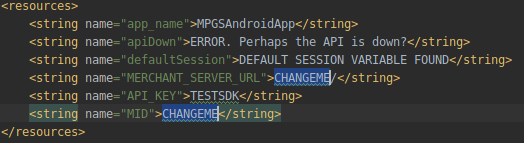
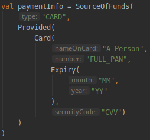

# MPGS Android App

Android app for MPGS testing, designed to be used in conjunction with the Dangerous Tech [MGPS Merchant Server](https://github.com/dangeroustech/MPGSMerchantServer).

Please modify configuration within _strings.xml_ to add your MPGS information.

Please modify the paymentInfo variable in _MainActivity.kt_ in order to add a payment card.

